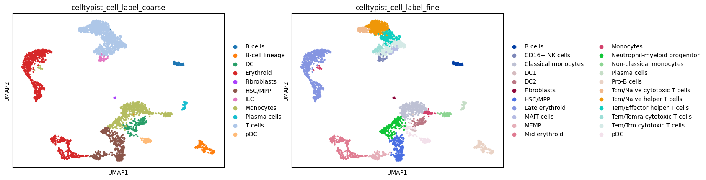
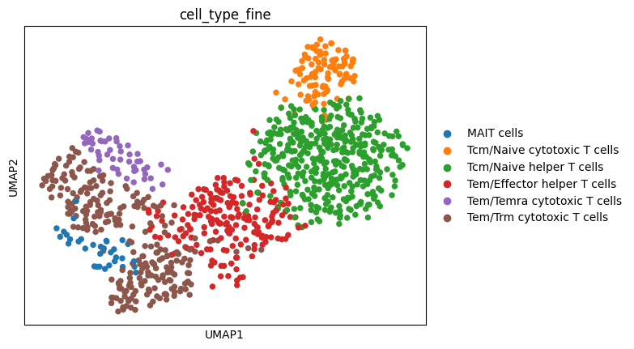
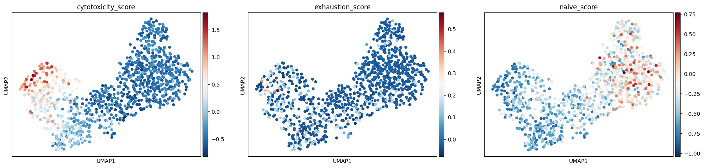

# scRNA-seq T Cell Analysis

Single-cell RNA-seq analysis of human PBMC using Scanpy and CellTypist,
focusing on cell type identification and characterization of T cell
subpopulations including naive, effector, and cytotoxic states.

## Dataset

- **Source:** [GSE120221](https://www.ncbi.nlm.nih.gov/geo/query/acc.cgi?acc=GSE120221) — human PBMC, donor A
- **Input:** 2,994 cells × 33,694 genes (10X Chromium, legacy 2-column MTX format)
- **After QC:** 2,989 cells × 17,213 genes

## Pipeline

### Notebook 01 — QC, Normalization, Clustering, and Annotation
`notebooks/01_qc_normalization_clustering.ipynb`

**QC & filtering**
- Flagged mitochondrial (MT-), ribosomal (RPS/RPL), and hemoglobin (HB*) genes per cell
- Filtered cells with <200 detected genes; genes detected in <3 cells
- Doublet detection via Scrublet
- Dataset was largely clean: most cells <5% MT reads, max ~22%

**Normalization & dimensionality reduction**
- Median-count normalization + log1p transformation; raw counts preserved in `.layers['counts']`
- Top 2,000 highly variable genes selected; features scaled (max value 10)
- PCA → k-NN graph → UMAP

**Clustering**
- Leiden clustering at resolution 0.5; 16 clusters identified
- Marker genes identified per cluster by Wilcoxon rank-sum test

**Cell type annotation**
- CellTypist with majority voting, using two complementary models:
  - `Immune_All_High.pkl` → coarse labels (broad cell type)
  - `Immune_All_Low.pkl` → fine labels (immune subtype resolution)
- 5,096 reference genes matched across both models
- Confidence scores stored alongside labels for QC

**Output**
- Annotated object saved to `data/adata_annotated.h5ad`
- UMAP visualizations: Leiden clusters, coarse/fine cell type labels, per-cell confidence scores, dendrogram of cell type relationships

### Notebook 02 — T Cell Subset Analysis
`notebooks/02_tcell_subset_analysis.ipynb`

**Subsetting & re-embedding**
- Subset 1,041 T cells from annotated PBMC object
- Recomputed neighbors and UMAP within T cell subset to resolve
  finer structure

**Differential expression**
- Wilcoxon rank-sum test across six CellTypist fine-label subtypes
- Cytotoxic markers (GNLY, GZMH, NKG7, GZMK) strongly enriched in
  Tem/Temra and Tem/Trm cytotoxic populations
- Naive/central memory populations show absence of strong effector
  markers, consistent with resting transcriptional state

**Gene signature scoring**
- Scored each cell for cytotoxicity (GZMB, GZMK, PRF1, NKG7, GNLY),
  exhaustion (PDCD1, LAG3, HAVCR2, CTLA4, TIGIT), and naive/memory
  (CCR7, SELL, TCF7, LEF1) signatures
- Cytotoxicity and naive scores concentrate in expected UMAP regions
- Exhaustion signal weak and diffuse, consistent with healthy donor
  PBMCs; exhaustion develops under chronic antigen stimulation

## Key Results







Top marker genes by cluster highlight expected PBMC populations:
- **T cells:** CCL5, B2M, HLA-B, HLA-C
- **Monocytes (classical):** FCN1, S100A9, S100A8, TYROBP, LYZ
- **Monocytes (non-classical):** FCGR3A, LST1, COTL1, AIF1
- **B cells / plasma:** CD74, HLA-DRA, HLA-DPA1, HLA-DPB1, DERL3
- **Erythroid:** HBA1, HBA2, HBB, SNCA, CA2
- **Progenitors:** SPINK2

CellTypist fine-model annotation resolved multiple T cell states; dendrogram confirms expected transcriptional relationships between immune cell populations.


## In Progress

- **Notebook 03** — Trajectory inference (PAGA/diffusion pseudotime) modeling naive → effector/cytotoxic differentiation

## Environment

```
python 3.11
scanpy
celltypist
scipy
anndata
```